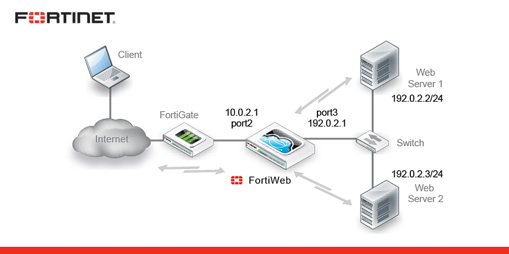

# FortiWeb
FortiWeb is a web application firewall (WAF) that protects hosted web applications from attacks that target known and unknown exploits.




## FortiWeb Models
* hardware
```
  • FortiWeb 100E
  • FortiWeb 400E
  • FortiWeb 600E
  • FortiWeb 1000E
  • FortiWeb 2000E
  • FortiWeb 3000E
  • FortiWeb 4000E
```
* virtual machine
```
  • Fortinet FortiWeb-VM01
  • Fortinet FortiWeb-VM02
  • Fortinet FortiWeb-VM04
  • Fortinet FortiWeb-VM08
```

## FortiWeb Licensing
* standard assets bunble
  * Security Service
  * Antivirus
  * IP Reputation
  * Geo DB
* advanced assets bundle
  * Credential Stuffing Defense
  * FortiSandbox Cloud


### Updating Signatures
* offline --> dont need lisense
* inline --> need lisence
Tip: iran is blocked by fortinet and we should use tunnel
```
config system autoupdate tunneling
  set status enable
  set address 192.168.1.10
  set port 8080
  set username fortiweb
  set password kh4sh3i
end
```


## FortiWeb Supported Platforms
```
• Apache Tomcat
• nginx
• Microsoft IIS
• JBoss
• IBM Lotus Domino
• Microsoft SharePoint
• Microsoft Outlook Web App (OWA)
• RPC and ActiveSync for Microsoft Exchange Server
• Joomla
• WordPress
```
by default fortiweb team design collection for above platform but we can create custom sign for other like Nuke,...


### Fortiweb protocol support
  ```
  * http
  * https
  * ftp
  * ftps
  ```
Tip: is we use fortiweb in edge, then all other trafic and protocol like SMB,.. come to WAF and made procces ! then we shouldnt do this.


### Fortiweb operation mode
```
  Reverse Proxy
  True Transparent Proxy
  Transparent Inspection
  Offline Protection
  WCCP
```
Tip: best mode is reverse proxy and we can ssl offloading and check entire package!


### Administrative Domain (ADOM)
* Administrative domains (ADOMs) enable the admin administrator to constrain other FortiWeb administrators’ access privileges to a subset of policies and protected host names.
* ADOMs are not enabled by default.

### FortiWeb Sessions
* fortiweb use "cookiesession1" for controll application
* we can not change this cookie name until now!!

### Configuration Steps
* Configure Server Pool  ==> real server ip
* Configure Virtual Server  ===> up hand that connect to fortigate 
* Configure Server Policy ==> set a collection of rule for application
  * Configure X-Forwarded-For
  * Configure Signatures
  ```
    • Cross Site Scripting (XSS)
    • SQL injection and many other code injection styles
    • Remote File Inclusion (RFI)
    • Local File Inclusion (LFI)
    • OS commands
    • Trojans/viruses
    • Known Exploits
    • sensitive server information disclosure
    • credit card data leaks
  ```
  * Configure Web Protection Profile 


### Log Types
* Event
  * Displays administrative events, such as downloading a backup copy of the configuration, and hardware failures
* Traffic
  * Displays traffic flow information, such as HTTP/HTTPS requests and responses.
* Attack
  * Displays attack and intrusion attempt events.

Tip: we can make .pcap file for connection WaF with Real server For T-shout traffic.


### Load Balancing Order Check
  * Health Check
  ```
    • ICMP
    • TCP
    • TCP Half Open
    • TCP SSL
    • HTTP
    • HTTPS
  ```
  * LB Algorithm
  ```
    • Round Robin
    • Weighted Round Robin
    • Least Connection
    • URI Hash
    • Full URI Hash
    • Host Hash
    • Host Domain Hash
    • Source IP Hash
  ```
  * Persistence
  ```
    • Source IP • Embedded Cookie
    • HTTP Header • ASP Session ID
    • URL Parameter • PHP Session ID
    • Insert Cookie • JSP Session ID
    • Rewrite Cookie • SSL Session ID
    • Persistent Cookie
  ```


### Compression, Acceleration,and Caching
  * we cant use caching, because developer dosnt access to clear cache
  * we dont have combinig css & js file into one file!
  * by default real web server use gzip for compression, and we dont use this section. 
  * we should change server and disable gzip for reduce proccess and do this in WAF side
  * brotli compression is use only in HTTPS


### Bot mitigation
```
  • Crawler
  • Vulnerability Scanning
  • Slow Attack
  • Content Scraping
  • Illegal User Scan
```
Tip : we create "/admin.php" fake link with Bot Deception ! for ban robots.


### HTTP Header Security
```
  • X-Frame-Options
    • DENY
    • SAMEORIGIN
    • ALLOW-FROM uri
  • X-Content-Type-Options
    • nosniff
  • X-XSS-Protection
      • Sanitizing Mode
      • Block Mode
  • Content-Security-Policy
      • default-src
  • Feature-Policy
    • Feature-Policy: microphone 'none'; geolocation 'none'
  • Referrer-Policy
    • Referrer-Policy: no-referrer
```


### Man in the Browser Protection
```
  • Obfuscation
  • Encryption
  • anti-keylogger
  • Ajax request white list
```
Tip : fortiweb encrypt all input and change name , ... but we have a lot false positive.


### Rewriting & Redirecting
* redirect http to https
* remove server response header like : x-power-by , ... 
* erase sensitive data when information discloser occured

### Certificate
```
  * SSL Offloading 
    * https(client,waf) , https(waf,server)
    * good for reduce proccess in real server and use http to connect waf to server 
  * SSL Inspection
    *  https(client,waf) , https(waf,server)
```

### Web Anti-Defacement
if developer update site, after 1 min site reverse to old backup. can normaly developer dosnt have access to this section.

### Web Vulnerability Scan
we can import accountix , IBM, HCL,... export vul report to fortiweb and then generate policy. but we shouldnt use that because false positive.

### Troubleshooting
```
  • Ping & traceroute
  • Log messages
  • Diff
  • Packet capture
  • Diagnostic commands in the CLI
  • Retrieving debug logs
```


## best practice for config
```
  * Sensitive Data Logging
  * Enable Traffic Log (temp)
  * Enable Traffic Packet Log (temp)
  * Global Setting  (Syslog/SIEM)
  * WVS (Acunteix - Import in FWB VM - Analysis)
  * Machine Learning (First Alert, Then Alert & Deny)
  * IP Reputation
  * IP List
  * DoS Protection
  * Bot Mitigation !Biometric (100% Alert ---- Alert & Deny    Real Browser Enforcement)
  * URL Access
  * Allowed Method (Alert ----> Alert & Deny)
  * CORS Protection
  * HTTP Protocol (Alert ---- > Alert& Deny)
  * Parameter Validation (Client Side)
  * File Security - Web Shell Detection   (AV, Extension)
  * HTTP Header Security (XSS, X-Frame-Options)
  * SQL/XSS Syntax Based (Alert & Deny)
  * Signature (Tuning)
  * Authentication
  * URL Rewrintg
  * XFF
  * Global White List
  * Certificate
  * Protected Hostname
  * Load Balancing
  * LDAP Users Login to WAF
  * System Time
  * Backup and Restore (FTP, Local)
  * Change WAF Interface Port
  * Password Complexity
  * HA 
  * FortiGuard (Online Update , Tunneling)
  * Advanced Shared IP
  * Replacement Message
  * SNMP v3
  * DNS & Route
```
